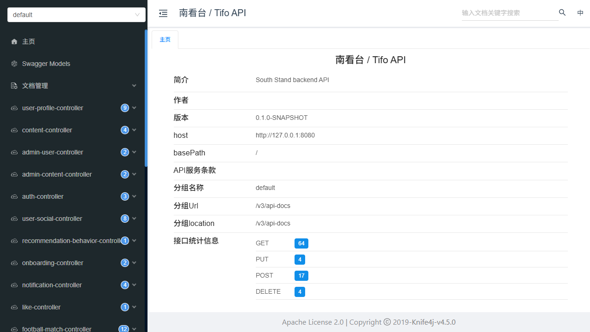

# 南看台 / Tifo

南看台（Tifo）是一款**卡片化足球内容流 + 赛事数据 + 社区互动** App 的后端服务，为 Flutter 移动客户端与 Vue 管理后台提供全部业务 API。

前端仓库：[violet-hekmatyar/Tifo-front](https://github.com/violet-hekmatyar/Tifo-front)

## 已实现功能

### 认证与用户

- 用户名密码注册 / 登录，JWT 签发与校验，当前用户信息
- 角色权限：普通用户与管理员隔离，管理端接口独立鉴权
- 首次偏好引导（主队、关注球队、关注球星）

### 首页 Feed（推荐引擎）

- 推荐组合策略：`pageSize=10`、同类卡片最小间隔 `min-gap=3`，首卡为比赛
- 卡片类型：比赛、内容、积分榜、话题讨论、球员评分、热门评论，以及**转会快讯**（`displayType=TRANSFER_BRIEF` 独立展示字段）
- 分页与曝光归因；推荐行为与指标采集
- Feed 接口对未登录访客只读开放，互动数据按登录态注入

### 足球数据

- 赛事 / 赛季、赛程（按"进行中 → 未开始 → 已结束"排序）
- 积分榜、球员榜、球队榜
- 比赛详情：总览、事件、统计、双方阵型阵容（首发 + 替补）、赛后评分
- 球队详情（总览 / 帖子 / 球员 / 数据 / 赛程）与球员详情（含生涯）
- 关注球队赛程聚合查询

### 内容与社区互动

- 内容发布（帖子 / 文章）、详情、编辑，发布话题与热点主题
- 评论（发表 / 列表）、点赞、收藏
- 关注 / 取关（用户、球队、球员），关注与粉丝列表
- 通知中心：互动通知（点赞等）
- 全局搜索（球队 / 球员 / 内容）

### 用户中心

- 个人摘要（统计、主队）、看台（关注球队 / 球员）
- 我的发布 / 点赞 / 收藏 / 评论分页列表；公开用户主页数据

### 管理与运维

- 管理端：用户管理、内容管理、工作台与健康检查
- 文件服务：受保护上传与公开演示资源（`/demo/**`）分离
- API 文档：Knife4j（OpenAPI 3）在线文档与调试

| API 在线文档（`/doc.html`） |
|---|
|  |

### 工程质量

- 单元测试 **105 项全部通过**（0 失败 0 跳过）
- 接口契约（Backend V1）冻结：响应包装、枚举、分页语义稳定，前端只消费
- 演示数据脚本幂等、可回滚（Seed ×2 → Validator → Rollback → 再 Seed 闭环），不污染非演示数据

## 未实现功能

以下能力**本期明确不实现**，不提供接口、不以假数据伪装：

- 手机号验证码登录 / 一键手机号登录
- 微信登录
- 私信、聊天会话、IM
- WebSocket 与 Push 推送
- 注销账号、修改密码
- **完整杯赛淘汰树**（后续独立必做专项：轮次 / 对阵节点 / 主客场聚合 / 晋级关系模型与树形查询接口，当前比赛列表契约不含轮次字段）

## 真实数据（football-data.org 同步）

赛事数据来自 football-data.org 免费套餐，由 `scripts/data-sync/sync_football_data.py` 生成幂等 SQL 后导入；操作手册见 [scripts/data-sync/RUNBOOK_2026-01-01_to_2026-10-01.md](scripts/data-sync/RUNBOOK_2026-01-01_to_2026-10-01.md)。

| 项 | 内容 |
|---|---|
| 赛事（8 个） | 英超 `2021`、西甲 `2014`、德甲 `2002`、意甲 `2019`、法甲 `2015`、欧冠 `2001`、世界杯 `2000`、欧洲杯 `2018` |
| 比赛时间范围 | **2026-01-01 ~ 2026-10-01**（跨 2025/26、2026/27 两个赛季；世界杯 2026-06~07 在内） |
| 生成 | `py -3 sync_football_data.py --date-from 2026-01-01 --date-to 2026-10-01 --out ..\sql\seed_football_data_2026.sql`（约 75~85 次请求，请求间隔 ≥ 6.5 秒） |
| 主键 | 直接用 football-data 全局 ID（英超 2021、阿森纳 57…），与演示数据 ID 段不冲突 |

| 表 | 导入量 | 说明 |
|---|---:|---|
| `football_league` | **8** | 中英双名、队徽、国家、排序 |
| `football_season` | **14** | 5 大联赛 + 欧冠各 2 个赛季，世界杯 / 欧洲杯各 1 个 |
| `football_competition_stage` | **25** | 中文阶段名：常规赛 / 联赛阶段 / 小组赛 / 32强 / 附加赛 / 16强 / 8强 / 4强 / 三四名 / 决赛 |
| `football_team` | **192** | 含队徽、国家、主场、建队年（国家队 55 支队徽为 SVG） |
| `football_player` | **4050** | 其中 **2937 人（72.5%）带真实头像**（TheSportsDB，见 `scripts/data-sync/player_photos.py`），其余用本地首字母头像兜底 |
| `team_player` / `football_team_season_player` | **4530 / 5428** | 阵容；后者是 App 球队/球员详情实际读的表 |
| `football_standing` / `football_team_competition_stat` | **312 / 312** | 积分榜 / 球队榜（由积分榜派生场次、进失球） |
| `football_player_competition_stat` | **1296** | 射手榜（每赛季前 100 名） |
| `match_info` | **1403** | 其中 **172 场标记「重要」**（欧冠/世界杯/欧洲杯淘汰赛 + 联赛前 6 对阵） |

- 免费套餐不提供：比赛事件、首发阵容、出场统计、战报、比赛场地、球衣号、球员身高/体重/身价 —— 这些字段为空；需要事件时按短时间段单独跑 `--with-events`。
- 采集与匹配均带离线自检：`sync_football_data.py --self-test`、`selftest_football_sync.py`、`player_photos.py --self-test`。

## 演示数据

- 演示球队 / 球员 / 比赛 / 内容均有独立来源标记与保留 ID 范围，转会快讯等演示卡片在响应中明确标注"演示"
- 初始化：`scripts/windows/init-demo-data.ps1`（非破坏性增量）；校验与回滚脚本见 `scripts/sql/`
- **与真实数据并存时**：用 `scripts/sql/retire-demo-data.sql` 退役演示赛事与演示账号（软删、可回滚，配 `validate-retired-demo-data.sql` 校验），
  否则 App 会同时列出演示联赛与真实赛事；内容/互动域（帖子、评论等）不在退役范围内

## 技术栈（简要）

```text
Spring Boot 3.2.4 + JDK 17 + MySQL 8 + Redis 7
MyBatis-Plus + Spring Security/JWT + Knife4j(OpenAPI 3)
```

## 快速开始

```powershell
# 构建（需本机具备 MySQL 8 与 Redis 7，配置见 application*.yml）
mvn clean package -DskipTests

# 启动（构建产物为 target\south-stand-server.jar）
java -jar target\south-stand-server.jar

# 验证
curl http://127.0.0.1:8080/api/public/health

# API 文档
# 浏览器打开 http://127.0.0.1:8080/doc.html
```

## 文档入口

- 文档地图：[docs/00_DOCUMENT_MAP.md](docs/00_DOCUMENT_MAP.md)
- 前后端交接：[docs/FRONTEND_BACKEND_HANDOFF_V1.md](docs/FRONTEND_BACKEND_HANDOFF_V1.md)
- 快速接入：[docs/FRONTEND_BACKEND_QUICKSTART_V1.md](docs/FRONTEND_BACKEND_QUICKSTART_V1.md)

## 安全约束

不要提交真实密码、真实服务器 IP、真实 Token、JWT Secret、`.env` 或 `application-prod.yml`。
